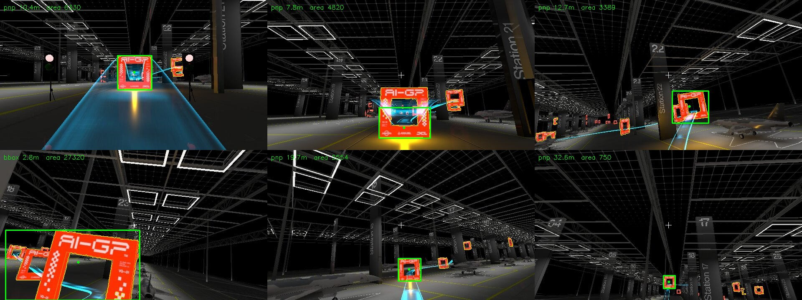

# AI Grand Prix — Autonomous Drone Racing

An autonomous racing client for the DCL drone simulator. It connects over
MAVLink, reads telemetry and a 30 Hz FPV camera stream, and flies a quadrotor
through a sequence of gates with no human input — any control input during a
timed run is an instant disqualification.

The competition ran in two qualifiers with very different constraints, and this
repository holds both.

## Results

**Virtual Qualifier 1 — completed the full course.** Gate positions and the
active gate index arrive over telemetry, so navigation is a waypoint chase:
a position→velocity→attitude cascade with a tilt-compensated altitude loop.

The camera runs the whole time regardless. VQ1 is where the perception stack
was built: the detector back-projects a gate position every tick and telemetry
overrides it, so vision flew the full course live on every run without being
able to cost one.

Video:
[](https://youtu.be/HfdJw55CZkQ)

**Virtual Qualifier 2 — completed the full course.** VQ2 blocks
`ODOMETRY`, `ATTITUDE` and gate positions. The drone has a camera and an IMU
and nothing else, so it has to detect the gates, estimate its own state, and
steer on what it sees. It flew, it cleared gates, and it successfully finished the
course. The perception layer works and is measured, and the guidance system
worked, although it was not fast enough to qualify for further competition.



*Live detector output at 2.8 m through 32.6 m. Green is the tracked gate,
yellow the other candidate contours, and the label shows which estimator
produced the range. The cyan ribbon is the simulator's own course marking.*

Measured perception accuracy, from 934 frames diffed against true odometry:

| range | frames | median 3D error | p90 | PnP solve rate |
|---|---|---|---|---|
| < 5 m | 120 | 1.24 m | 1.42 m | 74 % |
| 5–15 m | 353 | 1.20 m | 1.60 m | 95 % |
| 15–25 m | 372 | 1.62 m | 3.96 m | 97 % |
| 25–40 m | 89 | 3.39 m | 11.45 m | 84 % |

Reproduce with `python -m analysis.accuracy`.

State estimation is a six-state gate-relative filter — IMU predicts at 400 Hz,
PnP detections correct it — measured against real odometry on a VQ1 flight:

| | median | vs baseline |
|---|---|---|
| position error | 1.04 m | **6.5×** better than raw strapdown |
| velocity error | 1.50 m/s | **2.8×** better than raw CV |

Reproduce with `python -m analysis.ekf_accuracy`.

## Layout

```
core/       MAVLink transport, camera transport, telemetry decode, clock sync
vq1/        telemetry-guided controller + the first gate detector
vq2/        vision-only controller, tracking detector, gate-relative VIO
analysis/   offline accuracy scoring and detector replay, with sample data
sysid/      system identification: thrust map and attitude dynamics
tests/      101 tests, no simulator required
```

## Running

Requires Python 3.9+ and the simulator listening on `127.0.0.1:14550`.

```bash
pip install -r requirements.txt

python -m vq1.main      # telemetry-guided
python -m vq2.main      # vision-only
python -m pytest        # tests, no sim needed
```

Then open the course in the simulator, wait for the drone to arm, and press
Race. The client holds on the pad until the countdown clears and survives a sim
reset, so one process covers many attempts.

## Architecture

Background threads share one dictionary behind a single lock. Nothing else
talks to the network.

```
sim :14550 ──► MAVLinkRX ──┐
                           ├──► shared_data ──► Controller ──► SET_ATTITUDE_TARGET
sim :5600  ──► VisionRX ───┘        ▲
                                    │
                          IMU estimation thread (VQ2 only)
```

`MAVLinkRX` decodes telemetry, including two non-standard messages the sim
wraps in `ENCAPSULATED_DATA`: race status and the chunked track layout.
`CameraRX` reassembles chunked JPEG frames; each qualifier subclasses it with
its own detector. The controller reads that state at a fixed rate and writes
attitude setpoints back.

Both qualifiers run four background threads — heartbeat, telemetry, clock sync
and the camera — with the control loop on the main thread. VQ2 adds one more:
the gate-relative estimator, at 400 Hz. It is deliberately decoupled from the
60 Hz control loop, since tying state estimation to the command rate throws
away three quarters of the IMU data.

Both entry points run until interrupted. The sim disarms and re-arms between
attempts and the controllers handle that in place, so one process covers a
whole session; Ctrl-C is the intended exit and shuts every thread down.

## Conventions

Everything is NED: X north, Y east, Z **down**, so a more negative Z is higher
and negative pitch is nose-down. The origin is wherever the drone armed. The
camera is mounted pitched 20° up from the body frame, which is why converting a
pixel bearing into a body-frame direction is never just a projection.

## Known issues

These are real and unresolved. They are listed because a repository that claims
everything works is less useful than one that says where the edges are.

The vision pipeline carries a **systematic −1.12 m vertical bias** — the median
signed error in the down axis, across every frame, on both the PnP and the
bounding-box paths. Because it is common to both estimators it is almost
certainly a frame or offset error rather than a perception limit: a candidate
is the object-frame origin, the fixed gate-elevation offset, or a camera
extrinsic mismatch. It was never tracked down.

`vq1/controller.py`'s along-course velocity setpoint carries a constant
minimum-closing-speed floor that its cross-course counterpart does not. The
asymmetry is deliberate and documented in the code, but it only works because
the VQ1 course runs along a single axis.

## Next steps

Everything below is aimed at VQ2 lap time. That round is scored on the fastest
completed run, so speed is what the remaining work is for.

**Path planning.** The controller steers gate to gate with no representation of
the route it intends to fly, which caps how fast it can safely go. A planning
layer — mapping the course across attempts and flying a fitted trajectory
through it, rather than reacting to one gate at a time — is what makes a faster
line possible, and is required for any time-optimal method. A first attempt
built the Mueller/Hehn/D'Andrea motion primitive with a differential-flatness
mapping to attitude and thrust, deriving the quintic from the transversality
conditions rather than transcribing it. It failed in flight on a frame
mismatch between commanded and estimated yaw — the geometry was right and the
wiring was not — so it is not in this repo. Nothing here is code the drone
does not run.

**Learned control.** A policy trained directly against lap time is the more
ambitious version of the same goal, but it needs far more flight hours than
real-time runs can produce. That makes a fast offline simulator the real
prerequisite, built on the dynamics already identified in `sysid/` and once it
exists, automatically tuning the current controller for speed becomes cheap and
automatable.
