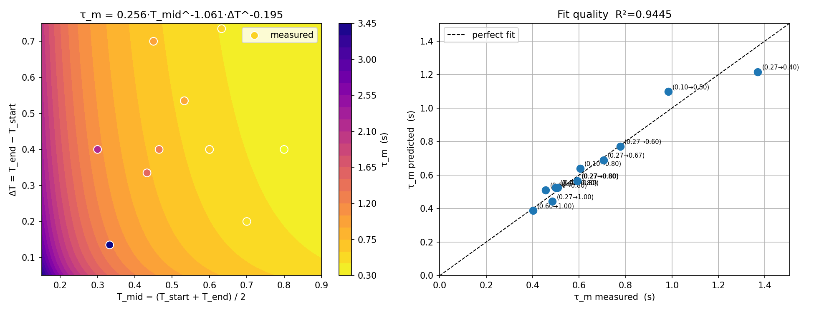

# System identification

Fitting a dynamics model to the simulated aircraft, so that tuning could stop
being guesswork and eventually happen offline.

## Why

Every gain change cost a real-time manual flight. That caps how much of the
parameter space anyone can explore, and it is the reason both controllers were
hand-tuned rather than optimised. An identified model is the prerequisite for a
fast surrogate simulator, where thousands of rollouts per second replace
clicking Race — and, separately, it is the process model a proper
visual-inertial filter needs for its prediction step.

The model is course-independent, so it transfers between qualifiers.

## Approach

Structured excitation rather than opportunistic logging. `sysid_excitation.py`
replaces the flight controller's control block, drives the aircraft to a
specified trim condition, holds it, applies a 3211 manoeuvre or doublet on one
axis, and recovers — writing a CSV and a JSON metadata sidecar per run, with
each sample tagged by phase so the analysis uses only the excitation window.

Identification is grey-box, over a 16-parameter model covering translational
drag (linear and quadratic), thrust mapping, and first-order attitude dynamics
per axis:

```
Xu_m Xuu_m Yv_m Yvv_m Tmax_m Zw_m Zww_m      translational
Gamma1..3  tau_p tau_q tau_r  Lp Mq Nr        rotational
```

`analyze_segment.m` runs equation-error to get a starting point, then
output-error refinement (SIDPAC) with a **minimal free-parameter vector per
axis** — two for roll, two or three for pitch depending on trim, three for yaw,
three for heave, two for lateral. Everything not directly excited by that
manoeuvre is passed through as a fixed constant rather than left free. That
keeps each optimisation small and well-conditioned;
letting the optimiser touch parameters the data cannot resolve produces
confident-looking numbers that mean nothing.

`drone_sysid_main.m` runs every valid CSV/metadata pair and aggregates results
into a gain schedule by trim regime. Regimes near thrust saturation are flagged
and extrapolated instead of fitted: at saturation the actuator cannot respond,
so identified control authority reads artificially low.

## Results

**Motor time constant.** Thrust step responses across the full command range
(`thrust/`) fit a two-parameter power law in step midpoint and step size:

```
tau_m = 0.256 · T_mid^-1.061 · dT^-0.195        R² = 0.944
```



The strong negative exponent on `T_mid` says the aircraft is markedly more
sluggish at low throttle — which is exactly the regime a descending approach
sits in, and it explains altitude tracking being worse on the way down than on
the way up.

**Hover trim** measured at 0.265, the value both controllers use.

**Lateral drag.** `fit_yv_m.m` separates linear `Yv_m` from quadratic `Yvv_m`
using the *full* bank-reversal trajectory rather than the quasi-steady tail.
This one is worth reading: in steady state lateral velocity only spans 5–9 m/s,
where `v` and `v·|v|` are nearly collinear and the regression collapses the
linear term to zero. Including the transient, where velocity passes through
zero on each reversal, widens the range to 0–9 m/s and makes the two columns
independent. The regression identity holds at all times, not just in steady
state, so the transient data is equally valid — and it is the only data that
separates the two coefficients.

**Remaining parameters** measured and fitted across the flight envelope (primarily
using `sysid_excitation.py` and `drone_sysid_main.m`).

## Layout

```
sysid_excitation.py       trim, hold, 3211/doublet, recover — writes CSV + meta
rotational_excitation.py  attitude-axis variant
identify_aT.py            thrust-to-acceleration mapping
matlab/                   equation-error + output-error identification
thrust/                   step-response data and fits
```

## Status

Parameter fits exist and are validated per axis. The surrogate simulator they
were meant to feed was never built, so the model informed hand-tuning but never
closed the loop into automated optimisation. That is the missing piece.
